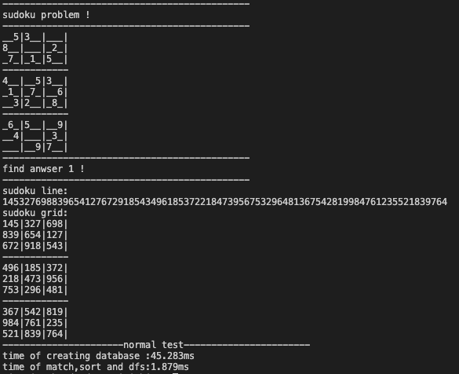
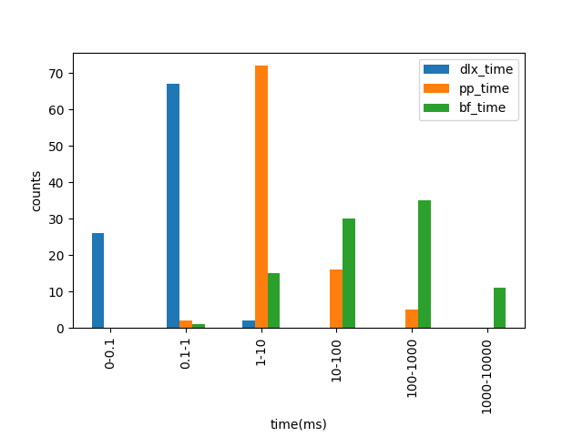

### What Is It
pp_sudoku is a noval C++ sudoku solver library which based on pose point.  

### How To Use

you can add our sudoku solver to your own code.  

```c++
/*1.create a database*/
DataBase db;
/*2.create a sudoku*/
string str("..53.....8......20.7..1.5..4....53...1..7...6..32...8..6.5....9..4....3......97.. ");
Sudoku mysudoku(str);
/*3.create a sudoku solver*/
SUDOKU_DFS sudoku_dfs(&db);
/*4.set flag for solver(find one solution or all solutions for sudoku)*/
sudoku_dfs.set_onlyone(false);
/*5.set sudoku for solver*/
sudoku_dfs.resetSudoku(&mysudoku);
```

you can compile the project with following command.  

```
mkdir build
cd build
cmake ..
make
```

run a simple sudoku solver:  

```
cd bin
./sigsolver ..53.....8......20.7..1.5..4....53...1..7...6..32...8..6.5....9..4....3......97.. 
```

result is shown below:  



### Test Case

TestCase：a simple testcase  
&nbsp;&nbsp;&nbsp;&nbsp;&nbsp;&nbsp;Input：..53.....8......20.7..1.5..4....53...1..7...6..32...8..6.5....9..4....3......97..  
&nbsp;&nbsp;&nbsp;Output：145327698839654127672918543496185372218473956753296481367542819984761235521839764  

TestCase：test the sudoku which has four solutions  
&nbsp;&nbsp;&nbsp;&nbsp;&nbsp;&nbsp;Input：009217030012005000735486219961728453200153967357649821190802000070001382020074196  
&nbsp;&nbsp;&nbsp;Output：689217534412395678735486219961728453248153967357649821196832745574961382823574196  
&nbsp;&nbsp;&nbsp;&nbsp;&nbsp;&nbsp;&nbsp;&nbsp;&nbsp;&nbsp;&nbsp;&nbsp;&nbsp;&nbsp;&nbsp;&nbsp;&nbsp;&nbsp;489217635612395748735486219961728453248153967357649821196832574574961382823574196  
&nbsp;&nbsp;&nbsp;&nbsp;&nbsp;&nbsp;&nbsp;&nbsp;&nbsp;&nbsp;&nbsp;&nbsp;&nbsp;&nbsp;&nbsp;&nbsp;&nbsp;&nbsp;649217538812935674735486219961728453284153967357649821193862745476591382528374196  
&nbsp;&nbsp;&nbsp;&nbsp;&nbsp;&nbsp;&nbsp;&nbsp;&nbsp;&nbsp;&nbsp;&nbsp;&nbsp;&nbsp;&nbsp;&nbsp;&nbsp;&nbsp;849217635612935748735486219961728453284153967357648821193862574476591382528374196  

TestCase：test sudoku which has a lot of solutions  
&nbsp;&nbsp;&nbsp;&nbsp;&nbsp;&nbsp;Input：.....6....59.....82....8....45........3........6..3.54...325..6..................  
&nbsp;&nbsp;&nbsp;Output：all solutions of the sudoku

### Benchmark
Several sudoku datasets are offered under data folder,Most of test files are "top N hardest" sudokus generated by different people, difficulty of every sudoku are different and variable.sudoku17.txt file contians all 17-cue sudoku which has 49151 test cases ,Mathematicians have proven that Sudoku requires at least 17 cues to have a unique solution, So we can believe that most of 17-cue are hard sudoku,the performance of sudoku solver on 17-cue sudoku shown the ability of sudoku solver.  

We compared our method with bf_sudoku and dlx_sudoku algorithm on different sudoku datasets.A benchmark program is offerred.  

```
cd bin
./sudoku_benchmark.sh ../data/top95.txt
```

The program will generate three log files under bin folder which recored the time cost of every sudoku test case on pp_sudoku,bf_sudoku and dlx_sudoku solver.then plot them on a figure:   

```
./plottime.py
```




### Conclusion

Our method has an advantage in 17-cue hard sudoku.It is faster than bf_sudoku.but it is hard to say that a sudoku solver is better than another,because performance of sudoku solver depends on the difficulty of sudoku.but for dlx_sudoku, it performs well almost on all datasets.DLX algorithm can solver most sudoku by less then 1ms,it is incredibly fast enough ^_^!.Donald E. Knuth is really a strongman.

### References  
[1] [The Probabilistic Sudoku Solver](https://www.feynmanlectures.caltech.edu/info/sudoku/pss.html)  
[2] [http://magictour.free.fr/sudoku.htm](http://magictour.free.fr/sudoku.htm)  
[3] [Solving Every Sudoku Puzzle](https://norvig.com/sudoku.html)  
[4] [Performance and Scalability of Sudoku Solvers](http://www.csc.kth.se/utbildning/kth/kurser/DD143X/dkand13/Group1Vahid/report/henrik-viksten.viktor-mattsson-kex.pdf)  
[5] [An Incomplete Review of Sudoku Solver Implementations](https://attractivechaos.wordpress.com/2011/06/19/an-incomplete-review-of-sudoku-solver-implementations/)  
